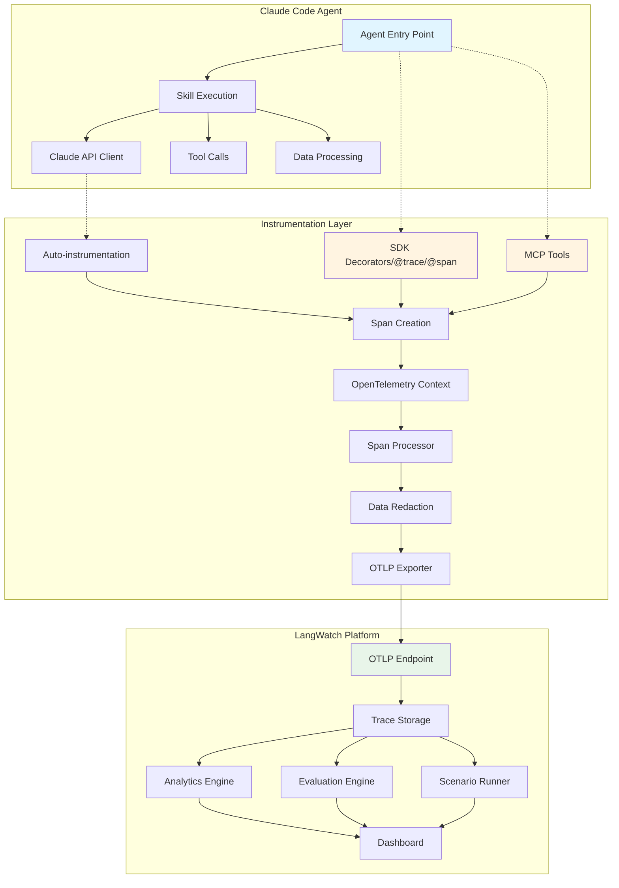

# Design Document: Claude Code Agent Integration

## Overview

This design specifies the integration between Claude Code skills-driven agents and the LangWatch observability platform. The integration enables developers to instrument their Claude Code agents to automatically capture execution traces, evaluate output quality, run scenario-based tests, and monitor operational metrics.

### Goals

- Provide seamless instrumentation for Claude Code agents with minimal code changes
- Capture comprehensive execution traces including skill executions and Claude API calls
- Enable automated quality evaluation and scenario-based testing
- Support both SDK-based and MCP-based integration approaches
- Maintain compatibility with OpenTelemetry standards for broader ecosystem integration

### Non-Goals

- Building a new agent framework (we integrate with existing Claude Code agents)
- Replacing existing LangWatch SDK functionality (we extend it for agent-specific use cases)
- Providing agent orchestration or workflow management
- Real-time agent intervention or control (observability only)

### Key Design Principles

1. **Minimal Instrumentation Overhead**: Agent performance should not be significantly impacted by tracing
2. **Developer Experience First**: Integration should be straightforward with clear documentation
3. **Standards-Based**: Use OpenTelemetry conventions where applicable
4. **Flexible Integration**: Support multiple integration patterns (decorators, MCP tools, auto-instrumentation)
5. **Privacy by Default**: Automatically redact sensitive data without explicit configuration

## Architecture

### High-Level Architecture



### Component Interactions

1. **Agent Execution Flow**:
   - User request enters agent entry point
   - Instrumentation layer creates root trace with unique ID
   - Agent executes skills, each creating nested spans
   - Claude API calls are automatically instrumented
   - Trace completes and exports to LangWatch

2. **Data Flow**:
   - Spans capture input/output, metadata, and timing
   - Span processor applies filters and redaction rules
   - OTLP exporter batches and sends to LangWatch endpoint
   - LangWatch stores traces and triggers evaluations
   - Analytics engine aggregates metrics for dashboards

3. **Integration Points**:
   - **TypeScript SDK**: Direct code instrumentation via decorators
   - **MCP Server**: Tool-based trace management for agent self-instrumentation
   - **OpenTelemetry**: Standard protocol for trace export
   - **LangWatch API**: REST endpoints for trace queries and management

## Components and Interfaces

### 1. SDK Integration Layer

#### Decorator-Based Instrumentation

```typescript
// Agent entry point instrumentation
@langwatch.trace({ name: "agent-execution" })
async function handleUserRequest(input: string): Promise<string> {
  // Agent logic
}

// Skill instrumentation
@langwatch.span({ type: "agent_skill", name: "code-generation" })
async function generateCode(prompt: string): Promise<string> {
  // Skill logic
}
```

**Key Methods**:
- `@trace(options)`: Decorator for agent entry points, creates root trace
- `@span(options)`: Decorator for skills and operations, creates nested spans
- `getLangWatchTracer(name)`: Get tracer instance for manual instrumentation
- `withActiveSpan(name, callback)`: Execute callback within span context

#### Claude API Auto-Instrumentation

```typescript
import { instrumentClaudeClient } from "langwatch/instrumentation/anthropic";

const client = new Anthropic({ apiKey: process.env.ANTHROPIC_API_KEY });
const instrumentedClient = instrumentClaudeClient(client);

// All API calls now automatically create LLM spans
const response = await instrumentedClient.messages.create({
  model: "claude-3-5-sonnet-20241022",
  messages: [{ role: "user", content: "Hello" }]
});
```

**Captured Data**:
- Model name and version
- Prompt tokens, completion tokens, total tokens
- Request messages and response content
- API latency and error details
- Cost calculation based on model pricing

#### Configuration Interface

```typescript
interface AgentInstrumentationConfig {
  apiKey: string;
  endpoint?: string;
  serviceName: string;
  samplingRate?: number; // 0.0 to 1.0
  captureInput?: boolean;
  captureOutput?: boolean;
  redactionRules?: RedactionRule[];
  customMetadata?: Record<string, string>;
}

// Initialization
await setupObservability({
  apiKey: process.env.LANGWATCH_API_KEY,
  serviceName: "my-claude-agent",
  samplingRate: 1.0,
  captureInput: true,
  captureOutput: true
});
```

### 2. MCP Server Integration

#### Tool Definitions

The LangWatch MCP server provides tools for agents to self-instrument:

**create_trace**
```typescript
{
  name: "create_trace",
  description: "Create a new trace for agent execution",
  inputSchema: {
    type: "object",
    properties: {
      name: { type: "string" },
      input: { type: "string" },
      metadata: { 
        type: "object",
        properties: {
          user_id: { type: "string" },
          thread_id: { type: "string" },
          task_type: { type: "string" }
        }
      }
    },
    required: ["name", "input"]
  }
}
```

**add_span**
```typescript
{
  name: "add_span",
  description: "Add a span to an existing trace",
  inputSchema: {
    type: "object",
    properties: {
      trace_id: { type: "string" },
      parent_span_id: { type: "string", optional: true },
      name: { type: "string" },
      type: { 
        type: "string",
        enum: ["agent_skill", "llm", "tool", "chain", "retriever"]
      },
      input: { type: "string" },
      output: { type: "string" },
      start_time: { type: "number" },
      end_time: { type: "number" }
    },
    required: ["trace_id", "name", "type"]
  }
}
```

**search_traces**
```typescript
{
  name: "search_traces",
  description: "Search traces by metadata filters",
  inputSchema: {
    type: "object",
    properties: {
      filters: {
        type: "object",
        additionalProperties: { type: "array", items: { type: "string" } }
      },
      startDate: { type: "string" },
      endDate: { type: "string" },
      pageSize: { type: "number" }
    }
  }
}
```

**record_evaluation**
```typescript
{
  name: "record_evaluation",
  description: "Record evaluation result on a trace",
  inputSchema: {
    type: "object",
    properties: {
      trace_id: { type: "string" },
      evaluator_name: { type: "string" },
      passed: { type: "boolean" },
      score: { type: "number" },
      details: { type: "string" }
    },
    required: ["trace_id", "evaluator_name", "passed"]
  }
}
```

#### MCP Server Architecture

The MCP server extends the existing LangWatch MCP implementation with agent-specific tools:

```
mcp-server/
├── src/
│   ├── tools/
│   │   ├── create-trace.ts       # New: Trace creation
│   │   ├── add-span.ts           # New: Span management
│   │   ├── record-evaluation.ts  # New: Evaluation recording
│   │   ├── search-traces.ts      # Existing: Enhanced for agents
│   │   └── get-trace.ts          # Existing: Enhanced for agents
│   └── index.ts                  # Tool registration
```

### 3. OpenTelemetry Integration

#### Span Types and Attributes

**Span Types** (using `langwatch.span.type` attribute):
- `agent`: Root span for agent execution
- `agent_skill`: Individual skill execution
- `llm`: Claude API call
- `tool`: External tool invocation
- `chain`: Sequence of operations
- `retriever`: Data retrieval operation

**Standard Attributes** (OpenTelemetry semantic conventions):
- `gen_ai.system`: "anthropic"
- `gen_ai.request.model`: Model name
- `gen_ai.response.model`: Actual model used
- `gen_ai.usage.prompt_tokens`: Input tokens
- `gen_ai.usage.completion_tokens`: Output tokens
- `gen_ai.request.max_tokens`: Max tokens setting
- `gen_ai.request.temperature`: Temperature setting

**LangWatch Custom Attributes**:
- `langwatch.span.type`: Span type classification
- `langwatch.user.id`: User identifier
- `langwatch.thread.id`: Conversation thread
- `langwatch.task.type`: Task classification
- `langwatch.risk.level`: Risk classification (low/medium/high)
- `langwatch.skill.name`: Skill identifier
- `langwatch.cost`: Calculated cost in USD

#### Context Propagation

OpenTelemetry context propagation ensures proper span nesting across async operations:

```typescript
// Context is automatically propagated
const tracer = getLangWatchTracer("agent");

await tracer.withActiveSpan("parent-operation", async (parentSpan) => {
  // This span is automatically nested under parent
  await tracer.withActiveSpan("child-operation", async (childSpan) => {
    // Nested span
  });
});
```

#### OTLP Exporter Configuration

```typescript
import { LangWatchExporter } from "langwatch";
import { BatchSpanProcessor } from "@opentelemetry/sdk-trace-base";

const exporter = new LangWatchExporter({
  endpoint: "https://app.langwatch.ai/api/otel/v1/traces",
  apiKey: process.env.LANGWATCH_API_KEY,
  headers: {
    "x-langwatch-service": "claude-agent"
  }
});

const processor = new BatchSpanProcessor(exporter, {
  maxQueueSize: 2048,
  maxExportBatchSize: 512,
  scheduledDelayMillis: 5000
});
```

### 4. Evaluation Framework

#### Evaluator Attachment

Evaluators can be attached at the project level or per-trace:

```typescript
// Project-level evaluators (configured in LangWatch UI)
// - Run automatically on all traces
// - Examples: hallucination detection, toxicity check

// Per-trace evaluators (SDK)
span.recordEvaluation({
  name: "code-correctness",
  passed: true,
  score: 0.95,
  details: "Code compiles and passes tests"
});
```

#### Built-in Evaluators for Code Agents

1. **Code Correctness Evaluator**
   - Checks if generated code is syntactically valid
   - Verifies code follows language conventions
   - Detects common security issues

2. **Response Accuracy Evaluator**
   - Uses LLM-as-judge to assess answer quality
   - Compares against expected output patterns
   - Detects hallucinations and factual errors

3. **Task Completion Evaluator**
   - Verifies agent completed the requested task
   - Checks for partial or incomplete responses
   - Validates output format matches requirements

#### Custom Evaluator Interface

```typescript
interface CustomEvaluator {
  name: string;
  evaluate(input: string, output: string, context?: Record<string, any>): Promise<EvaluationResult>;
}

interface EvaluationResult {
  passed: boolean;
  score: number; // 0.0 to 1.0
  details?: string;
  metadata?: Record<string, any>;
}

// Register custom evaluator
langwatch.registerEvaluator({
  name: "custom-code-quality",
  evaluate: async (input, output) => {
    // Custom evaluation logic
    return {
      passed: true,
      score: 0.9,
      details: "Code meets quality standards"
    };
  }
});
```

### 5. Scenario Testing System

#### Scenario Definition

Scenarios are defined in the LangWatch platform or via SDK:

```typescript
interface Scenario {
  id: string;
  name: string;
  situation: string; // Context description
  criteria: string[]; // Success criteria
  labels: string[]; // Tags for organization
}

// Create scenario via SDK
const scenario = await langwatch.scenarios.create({
  name: "Code generation for sorting algorithm",
  situation: "User requests a Python function to sort a list of integers",
  criteria: [
    "Generated code is syntactically valid Python",
    "Function accepts a list parameter",
    "Function returns a sorted list",
    "Code includes docstring"
  ],
  labels: ["code-generation", "python"]
});
```

#### Scenario Execution Engine

```typescript
// Execute scenario against agent
const result = await langwatch.scenarios.execute({
  scenarioId: scenario.id,
  agent: myAgent,
  timeout: 30000 // 30 seconds
});

interface ScenarioResult {
  scenarioId: string;
  traceId: string;
  passed: boolean;
  criteriaResults: {
    criterion: string;
    passed: boolean;
    details?: string;
  }[];
  executionTime: number;
  error?: string;
}
```

#### Batch Scenario Testing

```typescript
// Run multiple scenarios
const results = await langwatch.scenarios.executeBatch({
  scenarioIds: ["scenario-1", "scenario-2", "scenario-3"],
  agent: myAgent,
  parallel: true,
  maxConcurrency: 3
});

// Generate report
const report = langwatch.scenarios.generateReport(results);
console.log(`Pass rate: ${report.passRate}%`);
console.log(`Total scenarios: ${report.total}`);
console.log(`Passed: ${report.passed}`);
console.log(`Failed: ${report.failed}`);
```

### 6. Risk Assessment System

#### Risk Classification

Traces can be tagged with risk levels to prioritize monitoring:

```typescript
// Automatic risk classification based on operation type
const riskClassifier = {
  classify(operation: string, context: Record<string, any>): RiskLevel {
    if (operation.includes("delete") || operation.includes("drop")) {
      return "high";
    }
    if (operation.includes("update") || operation.includes("modify")) {
      return "medium";
    }
    return "low";
  }
};

// Manual risk tagging
span.setAttribute("langwatch.risk.level", "high");
span.setAttribute("langwatch.risk.reason", "Modifying production database");
```

#### Risk-Based Monitoring

```typescript
// Configure alerts for high-risk operations
await langwatch.alerts.create({
  name: "High-risk operation failure",
  condition: {
    riskLevel: "high",
    status: "error",
    threshold: 1 // Alert on any failure
  },
  channels: ["email", "webhook"]
});
```

## Data Models

### Trace Structure

```typescript
interface Trace {
  trace_id: string;
  project_id: string;
  timestamps: {
    started_at: number; // Unix timestamp ms
    inserted_at: number;
    updated_at: number;
  };
  input: SpanInputOutput;
  output: SpanInputOutput;
  metadata: {
    user_id?: string;
    thread_id?: string;
    task_type?: string;
    risk_level?: "low" | "medium" | "high";
    labels?: string[];
    custom?: Record<string, string | number | boolean>;
  };
  metrics: {
    prompt_tokens?: number;
    completion_tokens?: number;
    total_tokens?: number;
    total_cost?: number;
    first_token_ms?: number;
    completion_time_ms?: number;
  };
  error?: {
    has_error: boolean;
    message?: string;
    stacktrace?: string[];
  };
  spans?: Span[];
  evaluations?: Evaluation[];
}
```

### Span Structure

```typescript
interface Span {
  span_id: string;
  trace_id: string;
  parent_id?: string;
  type: SpanType;
  name: string;
  timestamps: {
    started_at: number;
    finished_at: number;
  };
  input?: SpanInputOutput;
  output?: SpanInputOutput;
  error?: {
    has_error: boolean;
    message?: string;
    stacktrace?: string[];
  };
  model?: string;
  params?: Record<string, any>;
  metrics?: {
    prompt_tokens?: number;
    completion_tokens?: number;
    cost?: number;
  };
  contexts?: RAGContext[];
}

type SpanType = 
  | "agent"
  | "agent_skill" 
  | "llm"
  | "tool"
  | "chain"
  | "retriever"
  | "guardrail"
  | "evaluation";

interface SpanInputOutput {
  type: "text" | "json" | "chat_messages" | "list";
  value: any;
}

interface RAGContext {
  document_id: string;
  chunk_id?: string;
  content: string;
  score?: number;
}
```

### Evaluation Structure

```typescript
interface Evaluation {
  evaluation_id: string;
  trace_id: string;
  span_id?: string;
  evaluator_name: string;
  evaluator_type: string;
  status: "processed" | "skipped" | "error";
  passed?: boolean;
  score?: number;
  details?: string;
  cost?: number;
  timestamps: {
    created_at: number;
    updated_at: number;
  };
}
```

### Scenario Structure

```typescript
interface Scenario {
  id: string;
  project_id: string;
  name: string;
  situation: string;
  criteria: string[];
  labels: string[];
  created_at: number;
  updated_at: number;
  archived: boolean;
}

interface ScenarioExecution {
  id: string;
  scenario_id: string;
  trace_id: string;
  passed: boolean;
  criteria_results: {
    criterion: string;
    passed: boolean;
    details?: string;
  }[];
  execution_time_ms: number;
  error?: string;
  created_at: number;
}
```


## Error Handling

### Error Capture Strategy

1. **Automatic Error Capture**:
   - All uncaught exceptions within instrumented spans are automatically captured
   - Error status, message, and stack trace are recorded on the span
   - Trace is marked with error status for filtering

2. **Graceful Degradation**:
   - If LangWatch endpoint is unavailable, traces are queued locally
   - After queue limit, oldest traces are dropped (FIFO)
   - Agent execution continues normally even if tracing fails

3. **Error Types**:

```typescript
// Instrumentation errors (non-blocking)
class InstrumentationError extends Error {
  constructor(message: string, cause?: Error) {
    super(message);
    this.name = "InstrumentationError";
    this.cause = cause;
  }
}

// Export errors (logged but don't block)
class ExportError extends Error {
  constructor(message: string, cause?: Error) {
    super(message);
    this.name = "ExportError";
    this.cause = cause;
  }
}

// Configuration errors (thrown at initialization)
class ConfigurationError extends Error {
  constructor(message: string) {
    super(message);
    this.name = "ConfigurationError";
  }
}
```

### Error Handling Patterns

```typescript
// Span-level error handling
try {
  await tracer.withActiveSpan("risky-operation", async (span) => {
    span.setType("agent_skill");
    // Operation that might fail
    const result = await riskyOperation();
    span.setOutput(result);
  });
} catch (error) {
  // Error is automatically captured on span
  // Agent can handle error normally
  console.error("Operation failed:", error);
}

// Trace export error handling
const exporter = new LangWatchExporter({
  apiKey: process.env.LANGWATCH_API_KEY,
  onError: (error) => {
    // Log export errors without blocking
    console.error("Failed to export trace:", error);
    // Optionally send to error tracking service
    errorTracker.captureException(error);
  }
});
```

### Retry Logic

```typescript
interface RetryConfig {
  maxRetries: number;
  initialDelayMs: number;
  maxDelayMs: number;
  backoffMultiplier: number;
}

const defaultRetryConfig: RetryConfig = {
  maxRetries: 3,
  initialDelayMs: 1000,
  maxDelayMs: 30000,
  backoffMultiplier: 2
};

// Exponential backoff for failed exports
async function exportWithRetry(
  spans: ReadableSpan[],
  config: RetryConfig = defaultRetryConfig
): Promise<void> {
  let attempt = 0;
  let delay = config.initialDelayMs;
  
  while (attempt < config.maxRetries) {
    try {
      await export(spans);
      return;
    } catch (error) {
      attempt++;
      if (attempt >= config.maxRetries) {
        throw error;
      }
      await sleep(delay);
      delay = Math.min(delay * config.backoffMultiplier, config.maxDelayMs);
    }
  }
}
```

## Testing Strategy

### Dual Testing Approach

This feature requires both unit tests and property-based tests to ensure comprehensive coverage:

- **Unit tests**: Verify specific examples, edge cases, error conditions, and integration points
- **Property tests**: Verify universal properties across all inputs using randomized testing

Together, these approaches provide complementary coverage where unit tests catch concrete bugs and property tests verify general correctness.

### Property-Based Testing Configuration

- Use `fast-check` library for TypeScript property-based testing
- Configure each property test to run minimum 100 iterations
- Tag each test with a comment referencing the design document property
- Tag format: `// Feature: claude-code-agent-integration, Property {number}: {property_text}`

### Unit Testing Strategy

Unit tests should focus on:

1. **Specific Examples**:
   - Trace creation with valid inputs
   - Span nesting with 2-3 levels
   - Error capture with known error types
   - Metadata attachment with sample values

2. **Integration Points**:
   - SDK decorator application
   - MCP tool invocation
   - OTLP exporter communication
   - LangWatch API interaction

3. **Edge Cases**:
   - Empty input/output handling
   - Missing optional fields
   - Invalid configuration values
   - Network timeout scenarios

4. **Error Conditions**:
   - Invalid API keys
   - Malformed trace data
   - Export failures
   - Concurrent span creation

### Test Organization

```
typescript-sdk/
├── __tests__/
│   ├── unit/
│   │   ├── instrumentation/
│   │   │   ├── decorators.test.ts
│   │   │   ├── claude-client.test.ts
│   │   │   └── context-propagation.test.ts
│   │   ├── exporters/
│   │   │   ├── otlp-exporter.test.ts
│   │   │   └── retry-logic.test.ts
│   │   └── evaluation/
│   │       ├── evaluator-attachment.test.ts
│   │       └── custom-evaluators.test.ts
│   ├── integration/
│   │   ├── sdk-integration.integration.test.ts
│   │   ├── mcp-tools.integration.test.ts
│   │   └── end-to-end-trace.integration.test.ts
│   └── property/
│       ├── trace-creation.property.test.ts
│       ├── span-nesting.property.test.ts
│       ├── metadata-handling.property.test.ts
│       └── sampling.property.test.ts
```

### Example Test Structure

```typescript
// Unit test example
describe("given a Claude Code agent with SDK instrumentation", () => {
  describe("when creating a trace with valid input", () => {
    it("creates a trace with unique trace ID", async () => {
      const tracer = getLangWatchTracer("test-agent");
      const span = tracer.startSpan("test-operation");
      
      expect(span.spanContext().traceId).toBeDefined();
      expect(span.spanContext().traceId).toHaveLength(32);
      
      span.end();
    });
  });
});

// Property test example
describe("property tests for trace creation", () => {
  it("creates valid traces for any input string", () => {
    // Feature: claude-code-agent-integration, Property 1: Trace creation with any input
    fc.assert(
      fc.property(fc.string(), (input) => {
        const tracer = getLangWatchTracer("test-agent");
        const span = tracer.startSpan("test-operation");
        span.setInput(input);
        span.end();
        
        // Verify trace was created successfully
        expect(span.spanContext().traceId).toBeDefined();
      }),
      { numRuns: 100 }
    );
  });
});
```

### Integration Testing

Integration tests verify the complete flow from agent execution to LangWatch platform:

1. **SDK Integration Test**:
   - Instrument a simple agent
   - Execute agent with test input
   - Verify trace appears in LangWatch
   - Verify all spans are properly nested

2. **MCP Integration Test**:
   - Create trace via MCP tool
   - Add spans via MCP tool
   - Query trace via MCP tool
   - Verify data consistency

3. **Evaluation Integration Test**:
   - Execute agent with evaluators configured
   - Verify evaluations run automatically
   - Verify evaluation results are recorded
   - Verify results appear in dashboard

### Performance Testing

Performance tests ensure instrumentation overhead is acceptable:

```typescript
describe("performance tests", () => {
  it("adds less than 5% overhead to agent execution", async () => {
    const iterations = 100;
    
    // Baseline: agent without instrumentation
    const baselineStart = Date.now();
    for (let i = 0; i < iterations; i++) {
      await runAgentWithoutInstrumentation();
    }
    const baselineTime = Date.now() - baselineStart;
    
    // With instrumentation
    const instrumentedStart = Date.now();
    for (let i = 0; i < iterations; i++) {
      await runAgentWithInstrumentation();
    }
    const instrumentedTime = Date.now() - instrumentedStart;
    
    const overhead = (instrumentedTime - baselineTime) / baselineTime;
    expect(overhead).toBeLessThan(0.05); // Less than 5%
  });
});
```


## Correctness Properties

*A property is a characteristic or behavior that should hold true across all valid executions of a system—essentially, a formal statement about what the system should do. Properties serve as the bridge between human-readable specifications and machine-verifiable correctness guarantees.*

### Property Reflection

After analyzing all acceptance criteria, I identified the following redundancies and consolidations:

**Redundancy Group 1: Data Completeness**
- Requirements 1.2, 2.2, 3.2, 7.4, 11.1 all test that specific fields are present in traces/spans
- These can be consolidated into a single property about required field presence

**Redundancy Group 2: Metadata Handling**
- Requirements 1.3, 4.5, 13.1, 13.2, 14.1, 14.2, 14.3 all test metadata attachment and preservation
- These can be consolidated into properties about metadata round-tripping

**Redundancy Group 3: Error Capture**
- Requirements 2.5, 3.5, 10.1 all test error capture in spans/traces
- These can be consolidated into a single property about error capture

**Redundancy Group 4: Automatic Instrumentation**
- Requirements 1.4, 3.1, 4.4 all test automatic span/trace creation
- These can be consolidated into properties about automatic instrumentation behavior

**Redundancy Group 5: Search and Filtering**
- Requirements 5.3, 13.5, 14.4 all test search/filter functionality
- These can be consolidated into a single property about filter correctness

**Redundancy Group 6: Alert Thresholds**
- Requirements 9.5, 10.5, 19.1, 19.2, 19.3 all test threshold-based alerting
- These can be consolidated into a single property about threshold alerting

**Redundancy Group 7: Notification Delivery**
- Requirements 19.4, 19.5 both test notification delivery
- These can be consolidated into a single property about notification delivery

**Redundancy Group 8: Sampling**
- Requirements 20.2, 20.3 both test sampling consistency
- These can be consolidated into a single property about sampling completeness

After consolidation, we have approximately 45 unique testable properties.

### Property 1: Unique Trace ID Generation

*For any* user request to a Claude Code agent, creating a trace should generate a unique trace ID that differs from all previously generated trace IDs.

**Validates: Requirements 1.1**

### Property 2: Trace Data Completeness

*For any* completed agent execution, the resulting trace should contain all required fields: input, output, timestamps (started_at, inserted_at, updated_at), and completion status.

**Validates: Requirements 1.2, 2.2, 11.1**

### Property 3: Trace Metadata Structure

*For any* trace created with metadata, the trace should preserve the metadata fields for user_id, thread_id, and task_type when provided.

**Validates: Requirements 1.3**

### Property 4: Automatic Trace Export

*For any* completed agent execution, the instrumentation layer should automatically add the trace to the export queue without requiring explicit export calls.

**Validates: Requirements 1.4**

### Property 5: Nested Span Creation

*For any* skill execution within an agent, a span should be created with a parent_id pointing to the current active span, creating a proper hierarchy.

**Validates: Requirements 2.1, 2.4**

### Property 6: Span Type Classification

*For any* skill execution, the created span should have the span type attribute set to "agent_skill".

**Validates: Requirements 2.3**

### Property 7: Error Capture in Spans

*For any* operation that throws an error, the span should capture the error status, error message, and stack trace.

**Validates: Requirements 2.5, 3.5, 10.1**

### Property 8: LLM Span Creation

*For any* Claude API call made through an instrumented client, an LLM span should be automatically created.

**Validates: Requirements 3.1**

### Property 9: LLM Span Metrics Completeness

*For any* LLM span, the span should contain model name, prompt tokens, completion tokens, and calculated cost.

**Validates: Requirements 3.2, 9.1**

### Property 10: LLM Span Content Capture

*For any* Claude API call, the LLM span should capture both the request messages and response content.

**Validates: Requirements 3.3**

### Property 11: Span Duration Recording

*For any* span, the duration should be a positive number equal to (end_time - start_time).

**Validates: Requirements 3.4**

### Property 12: Trace Decorator Functionality

*For any* function decorated with @langwatch.trace(), calling the function should create a root trace with the function name.

**Validates: Requirements 4.2**

### Property 13: Span Decorator Functionality

*For any* function decorated with @langwatch.span(), calling the function should create a span nested under the current active trace.

**Validates: Requirements 4.3**

### Property 14: Auto-instrumentation of Claude Client

*For any* Claude API call made through an instrumented client, a span should be created without explicit instrumentation code.

**Validates: Requirements 4.4**

### Property 15: Metadata Round-Trip

*For any* custom metadata attached to a trace or span, retrieving the trace/span should return the same metadata with the same values and types.

**Validates: Requirements 4.5, 14.1, 14.2, 14.3**

### Property 16: MCP Trace Retrieval Round-Trip

*For any* trace created via MCP tools, retrieving the trace by its trace ID should return a trace with the same input, output, and metadata.

**Validates: Requirements 5.4**

### Property 17: Search Filter Correctness

*For any* set of traces with metadata and any filter criteria, searching with those filters should return only traces that match all filter conditions.

**Validates: Requirements 5.3, 13.5, 14.4**

### Property 18: Evaluation Attachment

*For any* evaluation result recorded on a trace, retrieving the trace should include the evaluation with the same evaluator name, passed status, and score.

**Validates: Requirements 5.5, 7.1**

### Property 19: OTLP Format Compliance

*For any* exported trace, the data should conform to the OTLP protocol specification with valid trace_id, span_id, and timestamp formats.

**Validates: Requirements 6.1**

### Property 20: OpenTelemetry Semantic Conventions

*For any* LLM span, the span should include the standard OpenTelemetry semantic convention attributes: gen_ai.system, gen_ai.request.model, gen_ai.usage.prompt_tokens, gen_ai.usage.completion_tokens.

**Validates: Requirements 6.2**

### Property 21: Custom Endpoint Configuration

*For any* configured OTLP endpoint, traces should be exported to that endpoint rather than the default endpoint.

**Validates: Requirements 6.3**

### Property 22: Async Context Propagation

*For any* nested async operations, spans created in child operations should have parent_ids pointing to spans from parent operations, maintaining the call hierarchy.

**Validates: Requirements 6.4**

### Property 23: TracerProvider Reuse

*For any* existing OpenTelemetry TracerProvider, initializing LangWatch instrumentation should use the existing provider rather than creating a new one.

**Validates: Requirements 6.5**

### Property 24: Automatic Evaluator Execution

*For any* agent execution with configured evaluators, the evaluators should run automatically after execution completes without explicit invocation.

**Validates: Requirements 7.3**

### Property 25: Evaluation Result Structure

*For any* evaluation result, the result should contain evaluator name, passed status (boolean), and score (number between 0 and 1).

**Validates: Requirements 7.4**

### Property 26: Scenario Creation Round-Trip

*For any* scenario created with a situation and criteria, retrieving the scenario should return the same situation and criteria.

**Validates: Requirements 8.1**

### Property 27: Scenario Execution Trace Creation

*For any* scenario execution, a trace should be created with the span type "agent_test".

**Validates: Requirements 8.3**

### Property 28: Scenario Criteria Evaluation

*For any* scenario with defined criteria, executing the scenario should evaluate each criterion and return a pass/fail result for each.

**Validates: Requirements 8.4**

### Property 29: Scenario Report Completeness

*For any* batch of scenario executions, the summary report should include total count, passed count, failed count, and pass rate.

**Validates: Requirements 8.5**

### Property 30: Cost Calculation Correctness

*For any* LLM span with token counts and model pricing, the calculated cost should equal (prompt_tokens × prompt_price_per_token + completion_tokens × completion_price_per_token).

**Validates: Requirements 9.2**

### Property 31: Threshold Alert Triggering

*For any* configured alert threshold (error rate, latency, or cost), when the metric exceeds the threshold, an alert should be triggered.

**Validates: Requirements 9.5, 10.5, 19.1, 19.2, 19.3**

### Property 32: Risk Level Tagging

*For any* trace tagged with a risk level (low, medium, high), retrieving the trace should return the same risk level.

**Validates: Requirements 12.1**

### Property 33: Automatic Risk Classification

*For any* operation containing keywords like "delete", "drop", or "modify", the automatic risk classifier should assign a risk level of medium or high.

**Validates: Requirements 12.2**

### Property 34: High-Risk Alert Prioritization

*For any* high-risk operation failure, the alert should be marked with higher priority than low-risk operation failures.

**Validates: Requirements 12.5**

### Property 35: User ID Preservation

*For any* trace created with a user_id in metadata, retrieving the trace should return the same user_id.

**Validates: Requirements 13.1**

### Property 36: Thread ID Preservation

*For any* trace created with a thread_id in metadata, retrieving the trace should return the same thread_id.

**Validates: Requirements 13.2**

### Property 37: Authorization Header Redaction

*For any* HTTP request span with an Authorization header, the captured request should have the Authorization header value redacted or removed.

**Validates: Requirements 16.3**

### Property 38: API Key Redaction

*For any* captured data containing patterns matching API keys (e.g., "sk-...", "Bearer ..."), the sensitive portions should be redacted.

**Validates: Requirements 16.4**

### Property 39: Batch Dataset Acceptance

*For any* dataset with input test cases and expected outputs, the batch evaluation system should accept the dataset and execute the agent for each test case.

**Validates: Requirements 17.1, 17.2**

### Property 40: Batch Evaluator Execution

*For any* batch evaluation with configured evaluators, the evaluators should run on each test case result.

**Validates: Requirements 17.3**

### Property 41: Batch Report Completeness

*For any* completed batch evaluation, the summary report should include pass rate, aggregate scores, and individual test case results.

**Validates: Requirements 17.4**

### Property 42: Notification Delivery

*For any* triggered alert with configured notification channels (email or webhook), notifications should be sent to all configured channels.

**Validates: Requirements 19.4, 19.5**

### Property 43: Sampling Rate Adherence

*For any* configured sampling rate R (0.0 to 1.0), over a large number of traces, approximately R × 100% of traces should be sampled.

**Validates: Requirements 20.1**

### Property 44: Sampling Consistency

*For any* trace, if the trace is sampled, then all spans within that trace should be sampled; if the trace is not sampled, no spans should be sampled.

**Validates: Requirements 20.2, 20.3**

### Property 45: Sampling Metadata Inclusion

*For any* sampled trace, the trace should include metadata indicating the sampling rate that was applied.

**Validates: Requirements 20.4**

